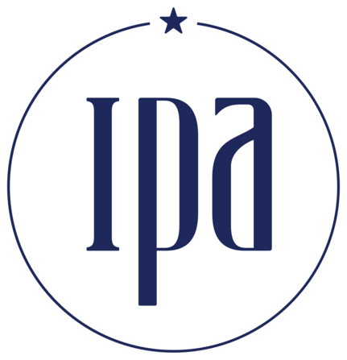

# rtctrl

A C++17 control library for the
[CRANE-X7](https://rt-net.jp/products/crane-x7/) 7-DOF robot arm.

- **Robust inverse kinematics** (error-damped Levenberg–Marquardt via
  [mi-lib/roki](https://github.com/mi-lib), structured results)
- **Dynamics-based control**: gravity compensation and computed-torque
  trajectory tracking through Dynamixel current control
- **Sim⇄real bridge**: controllers run unchanged on a roki dynamics
  simulator and on the hardware
- **Test-driven down to the wire**: an XM-servo emulator serves
  Protocol 2.0 over a pseudo-terminal, so the unmodified DynamixelSDK
  path is covered in CI — no robot required
- **Layered safety**: servo-side Bus Watchdog plus a host deadman
  (stale commands or frozen feedback) that escalates to bus silence;
  activation never commands motion (current-mode activation is
  zero-current — apps must command support immediately or explicitly
  stage a preload)

Robotics computation is delegated to
[mi-lib](https://github.com/mi-lib), motor communication to
[DynamixelSDK](https://github.com/ROBOTIS-GIT/DynamixelSDK); rtctrl is
the CRANE-X7-specific layer joining them.

## Quick start

```sh
git submodule update --init third_party/mi-lib \
    third_party/DynamixelSDK third_party/crane_x7_description
./tools/bootstrap_milib.sh
cmake -B build -DCMAKE_BUILD_TYPE=Release && cmake --build build -j
ctest --test-dir build

# no robot? rehearse everything against the emulator:
./build/apps/dxl_emu --link /tmp/ttyDXL &
./build/apps/dxl_inspect --port /tmp/ttyDXL scan
```

## Documentation

Start at **[docs/](docs/README.md)**: a user guide (philosophy,
architecture, getting started, usage), the control-theory notes with
full derivations, the hardware bring-up checklist, and the project
records.

Hardware sessions: read
[docs/hardware/bringup.md](docs/hardware/bringup.md) first — and keep
the power cutoff within reach.

## AI Assistance & Development Workflow

This project is developed with the assistance of an AI coding
assistant. The AI is also used to generate commit messages and parts
of the documentation, including the theory notes and the project
records.

**Workflow:**

1. **Context & Theory (Human):** The maintainer
   ([@hrshtst](https://github.com/hrshtst)) sets the project
   constraints in `CLAUDE.md`/`AGENTS.md` and writes the theoretical
   background implemented as documentation in
   [docs/theory/](docs/theory/).
2. **Implementation (AI):** The AI assistant uses these documents and
   constraints to implement code, tests, and documentation, following
   the project's testing ladder: pure logic gets unit tests, bus
   behavior runs against the emulator, and anything producing motion
   passes simulation acceptance before any hardware run.
3. **Review & Revision (Human):** The maintainer reviews, tests, and
   revises the generated code; controller, protocol, and safety-gate
   changes additionally pass an external review before hardware use.
   Every hardware session is operated and supervised by the
   maintainer.

**Responsibility:**
All responsibilities for the code hosted in this repository lie with
the maintainer. The AI serves strictly as an implementation
assistant; final architectural decisions, safety dispositions, and
code quality are human-led.

**Feedback:**
If you identify problems, or find code that appears to be unoriginal
or rights-protected, please notify the maintainer immediately by
filing an issue.

**Contributor Policy:**
External contributors are welcome to use AI tools for assistance,
provided they adhere to the same standard of review and
responsibility. If you use AI to generate code for a Pull Request,
please disclose it in the PR description and ensure you have
thoroughly reviewed and tested the code.

## Acknowledgments

 &nbsp; &nbsp; 

This project is supported by the
**[MITOU Target Program](https://www.ipa.go.jp/jinzai/mitou/koubo/programs/target.html)**
(Reservoir Computing field) of the
[Innovation Platform Agency, Japan (IPA)](https://www.ipa.go.jp/en/index.html)
in FY2026. Details of the supported project can be found in the
official overview for
[FY2026](https://www.ipa.go.jp/jinzai/mitou/target/2026-reservoir/gaiyou-tg-1.html)
(Japanese).

## License

This project is licensed under the Apache License 2.0 - see the
[LICENSE](LICENSE) file for details.
