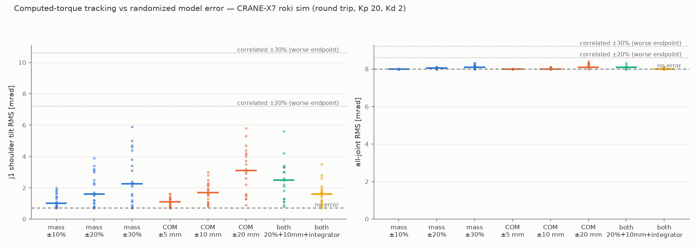
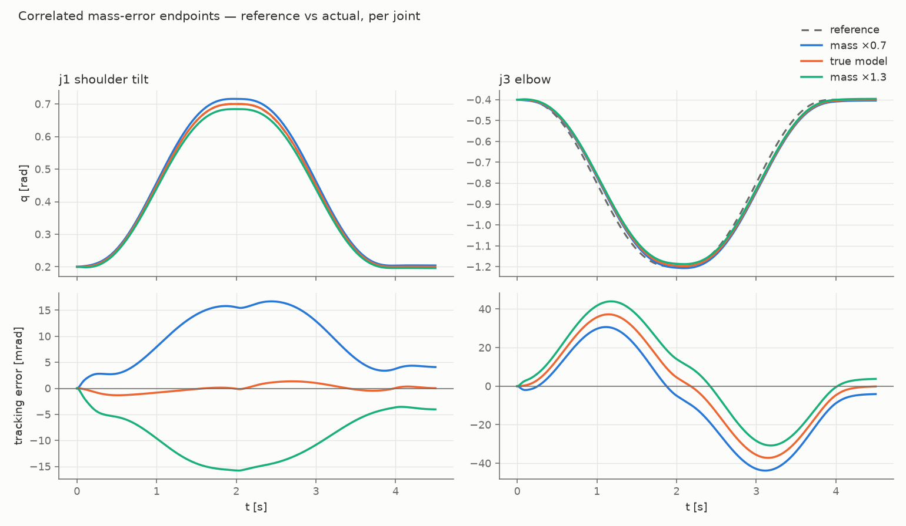

# Project history

Consolidated 2026-08-18 from twelve retired project records (planning
documents, campaign checklists, and study reports — the full list is
in the [Retired documents index](#retired-documents-index)). This file
is the single record of what was tried, what was found, and what was
decided. Old document names survive only as historical labels — most
visibly inside the immutable evidence files under `data/` (e.g.
`data/efl_study/results.json` embeds the name of its retired study
definition) and in milestone identifiers such as `M-GC1` or `D4` that
code comments still cite.

The *current* capability status lives in the
[guide overview](../guide/overview.md#what-works-where); the theory notes
carry the interpretive narratives. This file records the past: it is
append-only in spirit — the decisions below are closed.

## Timeline at a glance

| Date (2026) | Event |
|---|---|
| 07-17 | Plan approved after two external review rounds (M0–M8) |
| 07-21 | All milestones hardware-verified. `x7_wave` position-mode parity (M6); `x7_float` gravity float (M7); computed-torque tracking accepted at the reduced envelope after a nine-run campaign (M8) |
| 07-23 | Pass-1 tracking instrumentation hardware-validated (`pass1.csv`) |
| 07-27 | Flexible-mode identification campaign: qualification holds, one valid survey at P1 joint 1, amplitude pilot to the 0.30 Nm hard cap — stop rule triggered |
| 07-28 | Identification **closed, null result**; the 0.6 excursion-scale cap declared **FINAL**. `x7_track` settle-phase incident → PARKED |
| 07-29 | `x7_float` incident (gravity over-compensation) → parked; offline EFL study **closed, negative** at its first gate |
| 07-30 | M-GC3 objective float acceptance PASSED; subjective back-drive criterion FAILED |
| 07-31 | Owner WAIVES the back-drive criterion; `x7_float` un-parked under enforced conditions; default-scale adoption declined; M-GC3 formally closed by the reviewer |
| 08-04 | CT mass-error simulation study; `--evaluation-time` demonstration disposition |
| 08-18 | Project cleanup: records consolidated here; the closed `x7_ident` hardware app removed |
| 08-19 | `x7_gravity_demo` added (simplified gravity-compensation demonstration with customizable torque constants) and reviewed — the `--experimental-calibration` opt-in gate and the operator page followed; `apps/` sources reorganized into domain subdirectories (binaries stay flat in `build/apps/`) |
| 08-20 | Docs renamed lowercase and nested by nav section (published URLs changed; no redirects, by owner decision); Apache-2.0 license adopted; MITOU Target Program (IPA, FY2026) acknowledgment added; docs em-dash convention recorded with `docs/records/` exempt |

## Decision ledger

| Date | Decision | Status | Record |
|---|---|---|---|
| 2026-07-28 | The 0.6 excursion-scale cap in `x7_track` is the final supported operating boundary; full-amplitude torque mode is a closed goal | **FINAL** | [Computed torque](#hardware-campaign-and-the-final-06-scale-cap) |
| 2026-07-28 | Flexible-mode identification (pass 2 step A) closed on a precisely scoped null result | **CLOSED-NULL** | [Identification](#closure-decision-and-precise-scope) |
| 2026-07-28 | `x7_track` parked behind a reviewer-gated settle-phase fix (unimplemented) | **PARKED** | [Settle incident](#x7_track-parked-settle-phase-anti-damping) |
| 2026-07-29 | Offline EFL study closed negative at the preregistered gain gate; no hardware consequence | **CLOSED-NEGATIVE** | [EFL study](#results-and-interpretation) |
| 2026-07-31 | Subjective back-drive criterion WAIVED by the owner (risk/quality decision, not a test pass); `x7_float` un-parked under enforced conditions | **WAIVED** | [Gravity](#gate-outcomes-and-the-waived-back-drive-criterion) |
| 2026-07-31 | Default-scale adoption DECLINED — calibration stays per-application config | **FINAL** | [Vendor scales](#vendor-scale-hypothesis-and-evidence-honesty) |
| 2026-08-18 | `x7_ident` hardware app removed (campaign closed; sim twin and analysis retained) | **REMOVED** | [Removed app](#removed-hardware-app-x7_ident) |
| 2026-08-19 | `x7_gravity_demo` refuses non-vendor torque constants without the explicit `--experimental-calibration` opt-in (review directive: the config's [0.5, 1.0] scale bound is an electrical bound, not a validated float envelope) | **ENFORCED** | [Gravity demo](../hardware/gravity-demo.md#experimental-calibration-policy) |

## Origin and milestones M0 to M8

The project began from an owner brief (July 2026): rebuild the
CRANE-X7 control stack on mi-lib with a strict testing ladder (pure
logic → unit tests; bus behavior → wire-level emulator; motion → sim
acceptance before hardware). The approved plan ran M0 scaffold →
M1 URDF→ztk model port → M2 trajectories/.zvs/IK → M3 roki dynamics
sim bridge → M4 Dynamixel layer + emulator + inspection tools →
M5 hardware bring-up → M6 vendor parity → M7 torque estimation and
gravity compensation → M8 torque control. **All milestones completed
and hardware-verified 2026-07-21.**

Durable hardware findings from bring-up (M5): glibc ≥ 2.42 broke the
DynamixelSDK termios baud setup (fixed in `dxl::Port`); the servo Bus
Watchdog counts reads as traffic and freezes with torque ON on a
silent bus; `deactivate()` is not an e-stop — the layered watchdog
design (servo-side Bus Watchdog + host deadman that escalates to bus
silence) came out of this milestone. M7 closed with `x7_float`
floating and back-drivable on hardware, measured vs predicted torque
within ~0.01–0.03 Nm per joint at static poses — a result later
re-scoped by the calibration arc below. Post-completion hardening
fixed four defects and two review passes (pass 1 instrumentation,
pass 2 identification) followed; their outcomes are the chapters
below.

## Gravity compensation and torque-constant calibration

### The 2026-07-29 float failure

A hardware float session accelerated the *untouched* arm toward the
upright posture, peaking near 2.37 rad/s with joints riding their
upper limits. Two phases were distinguished: phase 1 was a
zero-current activation drop (an implementation gap — the arm
free-fell before compensation engaged — not miscalibration evidence);
phase 2 was strong evidence of excess actuation: with a command
scaling α > 1 the closed loop is M q̈ + C q̇ = (α − 1) g(q) — the
compensation itself pumps the arm uphill. The session was classified
a FAILED hardware float test and `x7_float` was parked.

### Vendor-scale hypothesis and evidence honesty

The leading explanation was the torque→current calibration: rtctrl
used the datasheet torque constants (1.783 Nm/A XM430-W350, 2.409
XM540-W270) where the vendor's software uses empirically tuned
constants (2.20, 3.60) — so rtctrl commanded ~23 % more current on
XM430 joints and ~49 % on the XM540 shoulder per model-torque. The
correction scales 1.783/2.20 = **0.810455** (XM430) and 2.409/3.60 =
**0.669167** (XM540) were adopted into
`config/crane_x7_vendor_scale.toml` — and deliberately **stated as
hypotheses, not measurements**: measured torque is reconstructed from
current through the same nominal constant that produced the command,
so the telemetry cannot independently estimate the output-torque gain
α, and no per-joint α was ever claimed. A proper per-joint
calibration experiment (known mass at a known lever arm, breakaway
asymmetry both directions) remains the open M7 follow-up.

### Gate outcomes and the waived back-drive criterion

The combined remediation (calibrated scales + position-held/preloaded
startup that removed the activation drop) **PASSED the objective
M-GC3 acceptance with wide margins** — peak speed 0.024 rad/s
(bound 0.1), displacement 0.0123 rad (bound 0.05), zero gate/clamp
engagements, final-second drift 0.0015 rad (bound 0.01). The
**subjective back-drive criterion FAILED** (reviewer disposition
2026-07-30): a j1 notch under hand-guiding — an energized
actuator-side behavior strongly associated with crossing the
low-current transition region q1 ≈ +0.27…+0.53 rad — and a small j4
positive hand-guided tendency (command ≤ 0.055 Nm).

Decisions taken (owner, 2026-07-31; reviewer's statement of record —
waiving is "a risk/quality decision, not a test pass"):

- **Default scales — adoption DECLINED.** The library keeps only the
  nominal datasheet constants; the repo default config keeps scale
  1.0 (the known-failed float configuration). Calibration remains a
  per-application configuration.
- **`x7_float` — UN-PARKED with the waiver**, under enforced
  conditions: the vendor-calibration gate is mode-independent (every
  session refuses any other scale vector *before bus contact*), and
  `--log` is required and created exclusively — an existing file is
  refused, never overwritten.
- **M-GC3 FORMALLY CLOSED** (reviewer, 2026-07-31): the
  gravity-calibration arc has no remaining findings or decisions.

Post-closure timing disposition (2026-08-04): `--evaluation-time`
selects a non-default 5–50 s window for demonstrations only; such
logs self-label `run_mode: demonstration` and are rejected by the
`--vendor` acceptance path. The archived M-GC3 evidence keeps its
original 5 s protocol.

### Open questions and non-goals

The j1 notch mechanism was **not isolated** (current-loop dynamics vs
load-dependent drivetrain friction): a power-off differential showed
no notch with the servo unpowered (a torque-enabled phenomenon); a
gate-free diagnostic showed clean static current delivery (error ≤ 7
counts, p95 = 3) with all large present-current steps
motion-concurrent; and a model replay closed the gravity-model line
for j1 (rtctrl vs vendor gravity models agree within ±0.015 A mean,
worst 0.044 A) while quantifying the j4 tendency as an amplitude
mismatch (rtctrl commands 1.37–1.49× the vendor model's j4 current,
within 1–3 goal counts). Standing non-goals: no host-side damping in
the float (it walks into the delayed-D-path anti-damping that parked
`x7_track`'s settle phase); no change to `dxl::torqueConstant` — the
calibration is an explicit, configured, command-side quantity applied
at exactly one boundary.

## Position-mode tracking on hardware

Position-mode control is the project's other hardware success, and
the closure of the torque-mode work made it the supported route for
large fast motions. `examples/x7_wave` (multi-joint synchronized wave
through `RealArm`, reference anchored to a captured posture) was
confirmed on the physical arm 2026-07-21 as the M6 vendor-parity
milestone — the capability mapping lives in [parity.md](parity.md).
`apps/x7_move_simple` (single-joint velocity-limited min-jerk) and
`apps/x7_pose` (placement onto a canonical posture with
measured-posture convergence) complete the position-mode toolset;
none of them touches the current-command path.

### Current-based position gain decision (2026-08-27)

A servo-side gain sweep on the tabletop pick-approach trajectory selected a
provisional current-based position configuration for the tested Crane-X7 and
firmware 47: position P gain 800 on every motor except ID 5 at 900, position I
gain 0, and position D gain 3525 on XM430 motors and 6375 on XM540 motors. The
host ran at 100 Hz with a 2.5 Nm per-joint effort ceiling. This is an
experiment-specific selection, not a new project-wide motor default. The
loadable `config/follow_cbp_75pct_d_id5_p900_params.toml` and matching
`config/follow_pick_cbp_75pct_d_id5_p900.toml` retain the selected setup.

Three repeated runs produced aggregate joint RMS errors of 0.017995 to
0.018138 rad and elbow peak errors of 0.064110 to 0.065628 rad, with no
overruns, skipped cycles, or stale commands. Compared with the vendor-reset
current-based position gains, high-frequency measured torque was about 22%
lower. Reducing D to 25% increased high-frequency velocity and made visible
vibration worse, so that setting was rejected; D=0 was not attempted. The
intermediate configurations and all raw evidence are indexed in
[data-archive.md](data-archive.md#follow-cbp-gain-sweep-20260827-servo-side-gain-sweep-2026-08-27).

## Computed torque

### Simulation results

The textbook law τ = ID(q_d, q̇_d, q̈_d) + Kp·e + Kd·ė tracks the M2
trajectory in the roki simulation at **RMS 0.0050 rad, 3.1× tighter
than bare PD** (asserted by `tests/integration/tracking_sim_test.cpp`
to this day). Simulation, including reflected rotor inertia, shows
none of the hardware pathologies below — the clearest illustration of
the testing ladder's rule that a sim pass is necessary, never
sufficient.

### Hardware campaign and the final 0.6 scale cap

Nine hardware runs (2026-07-21, eight logged as `trackN.csv`) showed
the textbook law is **not hardware-stable as written**. The shipped
controller became

```text
tau = ID + LP(scale_i · (Kp e + Kd e_dot_host)) + clamp(Ki ∫e)
```

with every added term tracing to a logged failure: the servo's
`PresentVelocity` estimate (~50 ms lag, 2× attenuation) destabilizes
Kd, so velocity is estimated host-side from positions; the ~13 Hz
gear-train resonance forces the low-pass on the PD and caps Kp ≈ 6;
the resulting ~1 Nm friction sag needs the clamped integrator;
per-joint gain scales keep the low-inertia distal joints out of
~5 Hz backlash limit cycles; a damped, quiescence-gated settle phase
precedes tracking; and feedback positions wrap to the principal angle.
So configured, tracking was **accepted on hardware at RMS 0.019/0.022
rad within the reduced-speed envelope** (2026-07-21).

The limitation: excursions beyond scale ≈ 0.6 extend the arm into
configurations whose ~4–5 Hz structural mode (shoulder gear
compliance vs arm inertia) the 100 Hz loop actively pumps — runs 7–8
oscillated coherently there even at matched trajectory rates.
**The 0.6 excursion-scale cap is FINAL (owner closure 2026-07-28)**:
the notch/phase-compensated D-path redesign and the full-amplitude
torque-mode end goal are closed, not deferred — the identification
that a notch design required stopped at its first gate (next
chapter). Large fast motions beyond scale 0.6 belong to position-mode
tracking.

### Root mechanism: delayed D-path phase

External review attributed the full-amplitude oscillation to the
sampled-feedback architecture, not to model error: **~117° of D-path
phase at the 4–5 Hz mode** (≈55° from the 50 ms PD low-pass with its
3.2 Hz corner, ≈30° from the velocity filter, ≈32° from the bus
pipeline), so nominally dissipative damping injects energy at the
mode. This mechanism reappears twice below: the EFL study's 13 Hz
flexible screen grows under the study controller, and the mass-error
study demonstrates that the model-error axis people usually blame
first is comparatively benign.

### x7_track parked: settle-phase anti-damping

On 2026-07-28 a scale-0.5 session never left the settle phase: from a
compact resting posture the pan (canonical joint 0) anti-damped at
4.33 Hz, growing ~50 → ~350 mrad peak-to-peak within a second of
torque-on; the operator cut power. The failure precedes the scale
argument (no scale is safe) and no code or configuration change
preceded it. `x7_track` is **PARKED** until a reviewer-approved
settle-phase fix lands — none is implemented; the authoritative
operational status is the registry in
[bringup.md](../hardware/bringup.md). Incident telemetry:
`track9.csv`/`track9.csv.settle` ([data-archive.md](data-archive.md),
`incidents-2026-07/`).

### Pass-1 instrumentation evidence

The pass-1 hardening (stale-feedback policy, controller-state
preservation through turnaround, quiescence gate that actually gates,
loop-signal logging — the D1–D8 items cited by code comments) was
hardware-validated 2026-07-23 (`pass1.csv`, scale 0.5): feedback
intervals 10.0 ms median / 10.4 ms max with zero sequence gaps,
receipt-matched first-apply delay 9.6–10.3 ms across 401 commands
(bound 20 ms), zero saturation or gate engagements, and the identity
ff + pd + i ≡ tau_raw holding on hardware.

### Integrator findings

Stationary current-mode holds (from the identification campaign)
exposed **integrator–stiction hunting**: a joint sticks in tolerance,
the integral winds at exactly Ki·e, commanded torque falls until
static friction releases, and the joint breaks ~26 mrad across the
band — recurring after every honest acceptance. Gain scaling cannot
fix it (the scales are PD-only; the integral is unscaled). The
reviewer-directed fix was **per-joint integral latching**: each joint
freezes its integral at its own 0.3 s in-band-and-quiet readiness,
with the frozen bias persisting (`ComputedTorque::freezeIntegral` and
the per-joint freeze mask — still in the library). A separate 8.9 Hz
±13 mrad controller-pumped pan limit cycle under stationary holds was
bounded by a joint-0 PD scale of 0.5 (`kIdentScale0`; FRFs are
controller-specific, so the tuning is recorded with any dataset).

## EFL offline study (closed negative 2026-07-29)

### Question and preregistered gain gate

After the cap closure, an external-reviewer-defined **offline** study
asked whether an exact-feedback-linearization controller (the model
evaluated at the *measured* state, acceleration-domain error dynamics
q̈ = q̈_d + Kd(q̇_d − q̇) + Kp(q_d − q), τ = M_model(q)·v) could beat
the shipped PRACTICAL law inside the same envelope. The study was
offline-only by charter — no hardware was operated, no `x7_track`
change was in scope. It was preregistered: cases (rigid R1/R2,
latency L1/L2, disturbance D±, flexible screens F4/F13 on the
two-mass fixture), metrics, gain grid (ω_n ∈ {4, 6, 8} rad/s,
ζ ∈ {0.7, 1.0}), a four-part decision rule C1–C4, and a discard gate:
any EFL-host cell exceeding 1.1× the baseline's peak error on the
development scenario eliminates that gain pair before the main grid.

### Frozen specification

> This subsection is the **live specification** referenced by
> `apps/study/x7_efl_study.cpp` and
> `tests/unit/{efl_test,study_metrics_test,lagged_arm_test}.cpp`.
> Do not edit it without re-running the study gate; it is preserved
> verbatim from the retired implementation plan.

The study definition requires these fixed but leaves them unnumbered;
they were frozen before implementation and baked into the study
executable as constants.

- **Torque-limit vector** [Nm], the REAL hardware rule
  `max(0, min(effort_limit, kt·I_servo) − current_limit_margin·kt)`
  evaluated with a frozen ASSUMED servo current-limit vector (offline
  there is no runtime reading), in raw units:
  `[1193, 2047, 1193, 1193, 1193, 1193, 1193, 1193]` — 1193 is the
  XM430-W350 factory default recorded in `src/emu/motor_emulator.cpp`;
  2047 is the XM540-W270 vendor factory default (an assumption, not
  repo-recorded). With the checked-in `config/crane_x7.toml`
  efforts/margins, `kCurrentUnitAmps = 0.00269`, and kt 1.783
  (XM430-W350) / 2.409 (XM540-W270):

  ```text
  [4.8305, 8.7955, 3.1085, 3.1085, 3.1085, 3.1085, 3.1085, 3.1085]
  ```

  Joint 0 is current-limit bound (kt·I = 5.7220 Nm < the 10 Nm
  effort limit). Both the assumed current-limit vector and the
  resulting torque limits are recorded in every result row.
- **Development-scenario start pose** (the authority's "existing
  rigid-sim start pose", frozen numerically — the
  `tests/integration/tracking_sim_test.cpp` initial pose):

  ```text
  [0.0, 0.2, 0.0, -0.4, 0.0, -0.2, 0.0, 0.1]
  ```

- **Gear deflection (F4/F13):** `deflectGear(probe_joint, 0.005)` —
  5 mrad motor-side against the held link, applied once before the
  first control cycle, identically for every compared controller.
- **Flexible-case run length:** 3.0 s. **Modal fitting window:**
  t ∈ [0.5, 2.5] s, split at 1.5 s into two equal halves.
- **Amplitude estimator:** fixed-frequency least-squares fit of
  `a·cos(2πft) + b·sin(2πft) + c` to the probe joint's link position
  over each window (f = the planted mode frequency), amplitude
  `A = √(a² + b²)` [rad] — exact for arbitrary phase and noninteger
  cycle counts, unlike a normalized Goertzel coefficient. Windows:
  `A_early` on [0.0, 0.5) s, `A₁` on [0.5, 1.5) s, `A₂` on
  [1.5, 2.5) s. **Censoring rule** (floor ε = 1e-9 rad): a below-floor
  amplitude is a censored observation, never a zero. Per screen and
  controller, exhaustively and mutually exclusively:

  - `A₁ ≥ ε ∧ A₂ ≥ ε` → uncensored rate `ln(A₂/A₁)/1.0 s`;
  - `A₁ ≥ ε ∧ A₂ < ε` → **censored-decayed**;
  - `A₁ < ε ∧ A₂ ≥ ε` → **censored-grown** (vanished, then
    reappeared): fails C4 outright;
  - `A₁ < ε ∧ A₂ < ε ∧ A_early ≥ ε` → **censored-decayed** (the ring
    existed and vanished below resolution);
  - `A₁ < ε ∧ A₂ < ε ∧ A_early < ε` → **inconclusive** (nothing
    measurable was excited): fails C4, recorded with its amplitudes.

  Censored-decayed satisfies the negativity requirement and compares
  as more negative than any uncensored rate; two censored-decayed
  results tie (which satisfies the no-greater-than-comparator test).
- **Delay-queue initialization (study mode):** `delay_cycles = 2`, the
  queue preloaded with two zero-current commands — the command accepted
  at cycle k is applied at cycle k+2, from the first cycle on, with no
  first-command passthrough. (Legacy mode — one-cycle delay with
  first-command passthrough — remains the default and is what
  `x7_track_sim` keeps using.)
- **D+/D− hold and scoring:** the loop runs for
  `trip.duration() + 3.0 s`, holding the trajectory's clamped endpoint
  sample as the reference after the trip ends (verify the endpoint
  clamp at implementation; otherwise hold the final sample explicitly).
  Settling time = first time after trajectory end at which the
  disturbed joint's |e| remains ≤ 0.01 rad continuously for 0.5 s;
  steady-state error = mean |e| over the final 1.0 s. Joint 1 (the
  disturbed joint) is scored; all joints are recorded.

#### Frozen decision-rule formulas

The authority's four-part rule (the retired study definition's
"Metrics and decision rule" — see
[the section above](#question-and-preregistered-gain-gate)), made
executable without judgment. Comparator: PRACTICAL in the six
rigid/delayed/disturbed cases `S = {R1, R2, L1, L2, D+, D−}`;
PRACTICAL-GF in `{F4, F13}`. Per case,
RMS is the total all-joint, all-sample tracking RMS; peaks are maxima
over all joints and samples; `sat(c)` is a controller's
controller-side clamp event count.

- **C1** (≥20% improvement in a majority):
  `|{c ∈ S : RMS_EFL(c) ≤ 0.8 · RMS_PRACTICAL(c)}| ≥ 4`.
- **C2** (no regression, required in EVERY `c ∈ T` where
  `T = S ∪ {F4, F13}`, against that case's comparator `cmp` —
  PRACTICAL in S, PRACTICAL-GF in F4/F13):
  `peak_err_EFL(c) ≤ 1.1 · peak_err_cmp(c)` and
  `peak_τ_EFL(c) ≤ 1.1 · peak_τ_cmp(c)` and
  `sat_EFL(c) ≤ sat_cmp(c)` (which implies no saturation where the
  comparator has none).
- **C3** (delayed completion): EFL-host completes L1, L2, D+, D−, F4,
  and F13 with finite states and metrics. A validly censored modal
  result counts as a COMPLETED metric (the classification is the
  result); its numeric rate is encoded as JSON `null` — never an
  infinity or a sentinel value.
- **C4** (flexible screens): for BOTH F4 and F13, EFL-host is
  uncensored-negative or censored-decayed, AND it is no worse than
  PRACTICAL-GF under the complete comparator ordering:
  comparator censored-decayed → only EFL censored-decayed is no worse;
  comparator uncensored → EFL censored-decayed passes, and EFL
  uncensored requires `rate_EFL ≤ rate_cmp`;
  comparator censored-grown → any uncensored-negative or
  censored-decayed EFL result is better;
  comparator inconclusive → the comparison is inconclusive and C4
  fails.
  EFL censored-grown or inconclusive fails C4 regardless of the
  comparator.

Verdict `promising = C1 ∧ C2 ∧ C3 ∧ C4`, computed by the executable
and written into the JSON as per-criterion booleans plus the
conjunction; prose interpretation stays in EFL-2.

### Results and interpretation

**The preregistered gain selection produced no surviving EFL-host
candidate, terminating the study at its first gate.** On the frozen
development scenario the PRACTICAL baseline's peak error was
0.0426 rad; every EFL-host cell posted ≥ 0.1388 rad (and every
DESIRED-host cell was far worse still, up to 1.32 rad). All 28 result
cells, including the explicit not-run failures for the held-out
cases, are preserved in `data/efl_study/results.json` (canonical,
byte-reproducible: schema 2, embedded clean-worktree build SHA).

Attribution, carefully scoped:

- **Established:** measured-state evaluation genuinely helps — at
  identical gains EFL-host beats DESIRED-host by 2.5–9.4× in peak
  error.
- **Inferred, not isolated:** the residual gap to PRACTICAL is
  consistent with the simulation's uniform 0.05 kg·m² reflected rotor
  inertia that the ID model omits (errors concentrated on moving
  joints, worst at the wrist, nearly gain-independent). There was no
  `reflected_inertia = 0` ablation and PRACTICAL differs from
  EFL-host in more than model evaluation, so this remains the leading
  explanation, not an experimentally isolated cause.
- **Byproduct:** on the flexible screens the planted 4.5 Hz ζ0.03
  mode decays (−1.56 s⁻¹) but the planted 13 Hz ζ0.05 mode **grows**
  (+0.10 s⁻¹) under the study controller — a miniature of the
  delayed-D-path mechanism from the computed-torque chapter.

Decision: further offline EFL work is not justified (competitiveness
would require at least a reflected-rotor-inertia model term plus the
M7 friction feedforward — new modeling belonging to a separate
proposal). No hardware flag, no `x7_track` change, no cap change.

## Flexible-mode identification (closed null 2026-07-28)

### Closure decision and precise scope

Decision (owner, 2026-07-28, following the reviewer-confirmed stop
condition): pass 2 step A ended, and with it the notch/phase D-path
redesign — this is what made the 0.6 cap final.

What the experiment established is exactly this: **joint 1 at posture
P1 is not identifiable with the stationary small-signal current probe
up to the 0.30 Nm hard cap.** Gearbox stiction locked the output
shaft at every admissible amplitude (the probe joint reported a
single encoder count through 13 of 16 survey windows; pilot responses
of 22–68 µrad sat 10–30× below their run-measured 0.4–1.1 mrad noise
floors, non-monotonic in amplitude and phase-incoherent), and the
servo's output-shaft encoder is structurally blind to motor-side gear
wind-up. **Other joints, other postures, other sensing, and other
excitation strategies were NOT tested.** The closure generalizes by
judgment, not by experiment: the ~4–5 Hz whole-arm mode that forced
the cap participates most strongly at the gravity-loaded shoulder
joints — exactly where stiction is highest — so in-method adjustments
were judged unlikely to close the gap, and the out-of-method routes
were judged not worth their cost absent a concrete need for
scale > 0.6.

### What survives

- The **commanded→measured actuator transfer**: magnitude ~1.00–1.05
  flat across 2–20 Hz; phase −8° to −76° AFTER the receipt-matched
  ~9.9 ms apply-delay correction (i.e. a further ~10.6 ms of
  report-side/effective delay — total command→measured lag ≈ two
  cycles). This is the phase-budget input for any future compensator.
- The first **empirical stationary-hold noise floors** (0.4–1.1 mrad,
  10–30× the analytic figure): the servo encoder cannot support
  small-signal stationary work.
- The **session-safety machinery** (deadline ladder, quiesce,
  watchdogs), the pose-first startup pattern, and the analysis
  tooling (`tools/ident_analysis.py`) with its dataset-integrity
  guards.
- The preserved **null-result datasets** (`p1_j1_survey_r2`,
  `p1_j1_amp020/025/030`), which never enter mode fitting — sidecars
  tracked under `data/`, raw CSVs in the private archive
  ([data-archive.md](data-archive.md)).

### Reopening conditions

Reopening requires BOTH a concrete application need for scale > 0.6
AND one of: external link-side sensing (IMU/accelerometer — in the
tested configuration the flexible response was invisible to the servo
encoder); identification around a moving operating condition, where
motion linearizes the friction that defeated the stationary probe; or
dither-assisted excitation with its own safety analysis. Any
reopening restarts from the external review process. Until then,
large fast motions beyond scale 0.6 belong to position-mode tracking.

### Protocol and campaign summary

The campaign (stepped-sine current probes on one joint under a
constant-anchor computed-torque hold; nine external design-review
rounds) was implemented and sim-validated first — the sim twin
recovers planted modes at 4.51 Hz ζ0.033 and 13.01 Hz ζ0.058 — then
executed on hardware 2026-07-27. Hand placement failed four sessions
(gravity-loaded joints lost 0.06–0.18 rad in the limp gap), replaced
by the integrated pose-first placement/capture (transition sag
3.2 mrad vs the 80 mrad envelope). Qualification holds surfaced and
fixed the integrator–stiction hunting and the pan limit cycle
(computed-torque chapter). One mechanically flawless survey and the
three-point amplitude pilot then triggered the preregistered stop
rule. The full run-by-run record lives in the 14 tracked
`data/*.dwells.json` sidecars (tuning, per-dwell verdicts, frozen
biases) and the archived CSVs; `tools/ident_analysis.py` re-analyzes
them, refusing mode fits on data below the observability floor
("INSUFFICIENT USABLE DATA" — the truthful null verdict).

### Removed hardware app x7_ident

With the campaign closed, the parked hardware app `x7_ident` and its
session watchdog were removed on 2026-08-18. The simulation twin
(`apps/ident/x7_ident_sim.cpp` over the `TwoMassArm` fixture), the dwell
state machine (`apps/ident/ident_common.hpp`, still pinned by its unit and
sim-integration tests), and the analysis pipeline remain — method
validation and re-analysis of the archived datasets stay
reproducible. Reopening restarts from external review regardless.

## CT mass-error simulation study (2026-08-04)

A follow-up sim study asked how sensitive the shipped computed-torque
law is to mass/COM model error — the axis people usually blame first,
and the one the incident record shows was NOT the hardware killer
(that was the delayed D-path phase). 166 runs (correlated mass
scaling ×0.7–×1.3; randomized per-link mass ±20 %, COM ±10/±20 mm;
with/without integrator; 20 seeds per condition):

1. Every sampled randomized case was milder than the correlated
   references — independent link errors partially cancel where a
   uniform scale cannot.
2. **No numerical failure or divergence in any run** (finite-horizon
   claim only); randomized aggregate RMS within 5 % of the no-error
   baseline.
3. **COM error is the stronger class, millimeter for percent**:
   ±10 mm ≈ ±20 % mass in median j1 effect.
4. The shipped integrator improved j1 in 19/20 paired seeds.





Limitations: the rigid, lag-free simulation excludes precisely the
mechanisms that parked computed torque on hardware — this study
bounds model-error sensitivity only; a sim pass is necessary, never
sufficient. Evidence: `data/ct_mass_error_study/` (results, seeds,
binary/model SHA provenance); reproduction:
`tools/ct_mass_error_study.py` driving `examples/x7_ct_mass_error`.

## Consistency audit

A post-closure audit (executed 2026-07-28, two commits) unified
shutdown verification (exception-safe guards escalating to bus
silence on unconfirmed stops), strict CLI parsing across the hardware
apps, and documentation truth. No control behavior changed. One
deliberate scope choice stands: simulation-only apps keep permissive
parsing, because a sim app cannot torque hardware.

## Retired documents index

Consolidated 2026-08-18; the git history preserves every retired
document in full.

| Retired document | Content now lives in |
|---|---|
| `PLAN.md` (original brief + review rounds) | [Origin and milestones](#origin-and-milestones-m0-to-m8) |
| `IMPLEMENTATION_PLAN.md` (M0–M8, annotated) | [Origin and milestones](#origin-and-milestones-m0-to-m8), [Computed torque](#computed-torque) |
| `REMEDIATION_PLAN.md` (pass-1 D1–D8) | [Pass-1 evidence](#pass-1-instrumentation-evidence), [Root mechanism](#root-mechanism-delayed-d-path-phase) |
| `IDENTIFICATION_PLAN.md` (pass-2 design + Closure) | [Flexible-mode identification](#flexible-mode-identification-closed-null-2026-07-28) |
| `IDENTIFICATION_PROTOCOL.md` / `IDENTIFICATION_CAMPAIGN.md` | [Protocol and campaign summary](#protocol-and-campaign-summary) |
| `CONSISTENCY_REMEDIATION_PLAN.md` | [Consistency audit](#consistency-audit) |
| `ENVELOPE_STABILITY_PLAN.md` (EFL study definition) | [EFL study](#efl-offline-study-closed-negative-2026-07-29) |
| `EFL_STUDY_IMPLEMENTATION_PLAN.md` (frozen spec) | [Frozen specification](#frozen-specification) |
| `EFL_STUDY_RESULTS.md` | [Results and interpretation](#results-and-interpretation) |
| `CT_MASS_ERROR_STUDY.md` | [CT mass-error study](#ct-mass-error-simulation-study-2026-08-04) |
| `GRAVITY_CALIBRATION_PLAN.md` (M-GC0–M-GC3) | [Gravity compensation](#gravity-compensation-and-torque-constant-calibration) |

Historical labels that remain valid greppable citations: milestone
ids (`M0`–`M8`, `M-GC1`–`M-GC3`, `D1`–`D8`, `EFL-2`, pass 1/2),
dataset bare filenames (resolved by [data-archive.md](data-archive.md)),
and retired document names embedded in immutable evidence files under
`data/`.
